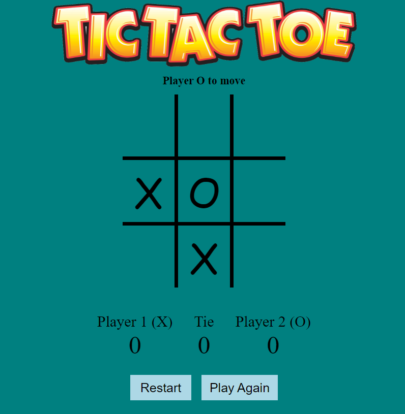

# Tic-Tac-Toe Game

**Languages(s) Used** 

1. Typescript: 5.2.2

**Dev Dependencies**

1. SASS: 1.71.1
2. Vite: 5.1.4
3. Typescript: 5.2.2

**Standard Dependencies**

1. Confetti: ^1.9.2

## **Table of Contents**

+ [Introduction](#introduction)
+ [Game Preview](#game-preview)
+ [Code Snippet](#code-snippet)
+ [Setup](#setup)


<a name="introduction"></a>
## **Introduction**


This project is a classic game of tic-tac-toe. Enjoy the two-player experience with an interactive UI which allows the players to either win or draw, an option to restart the game or play another round, as well as error handling for selected cells. 

<a name="game-preview"></a>
## **Game Preview**





<a name="code-snippet"></a>
## **Code Snippet**

``` js
// scoreboard 
const updateScoreBoard = () => {
  if (currentPlayer === playerX) {
    scoreX ++;
    scoreBoard[0].innerHTML = scoreX.toString()
  } else if (currentPlayer === playerO) {
    scoreO ++;
    scoreBoard[2].innerHTML = scoreO.toString()
  } 
}
```

<a name="setup"></a>
## **Setup**

To run this game locally, follow these steps:

Clone this repository to your local machine:

1. Git clone https://github.com/Sanjida213/tic-tac-toe.git
2. Open the project directory in your code editor
3. Run npm install in the root folder
4. Run npm run dev 